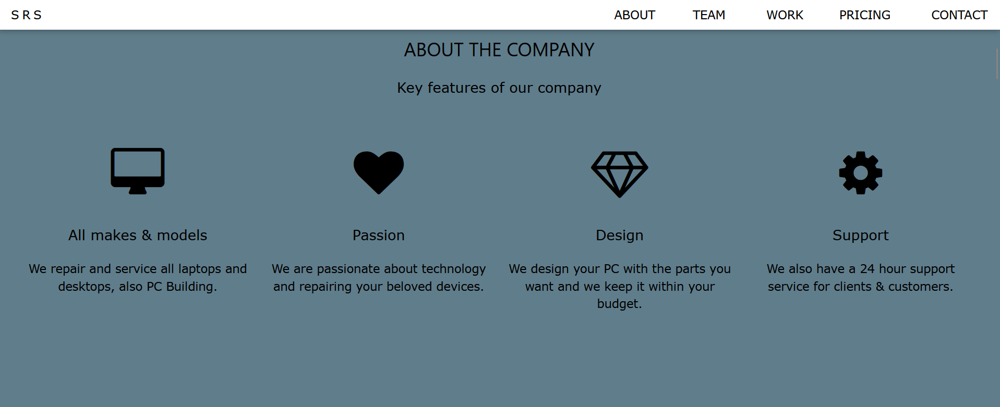
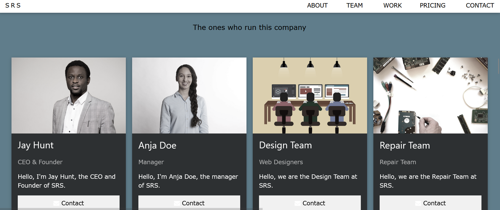
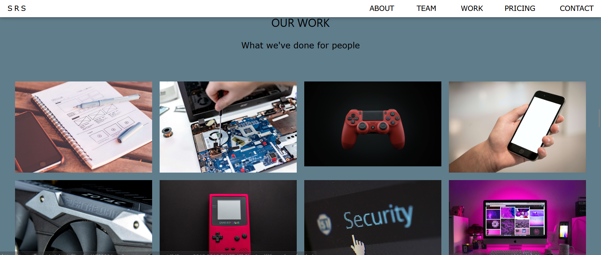
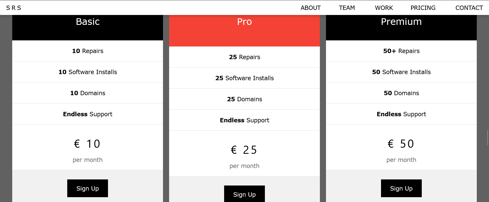
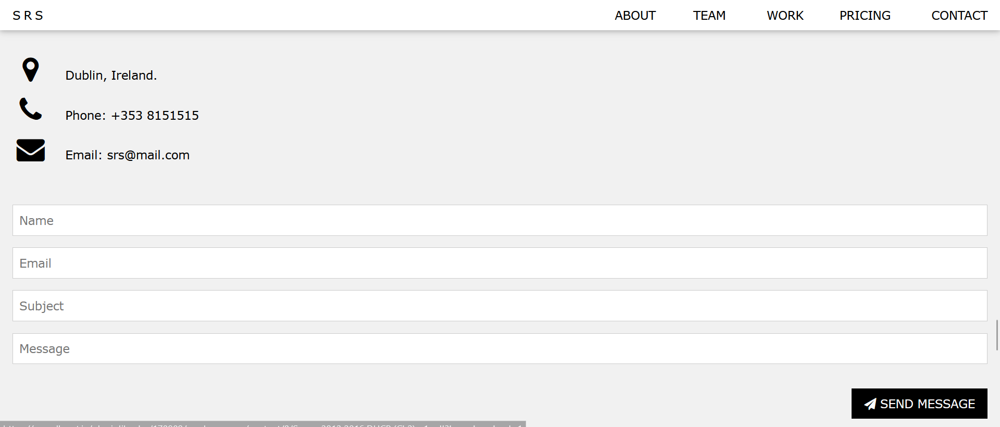
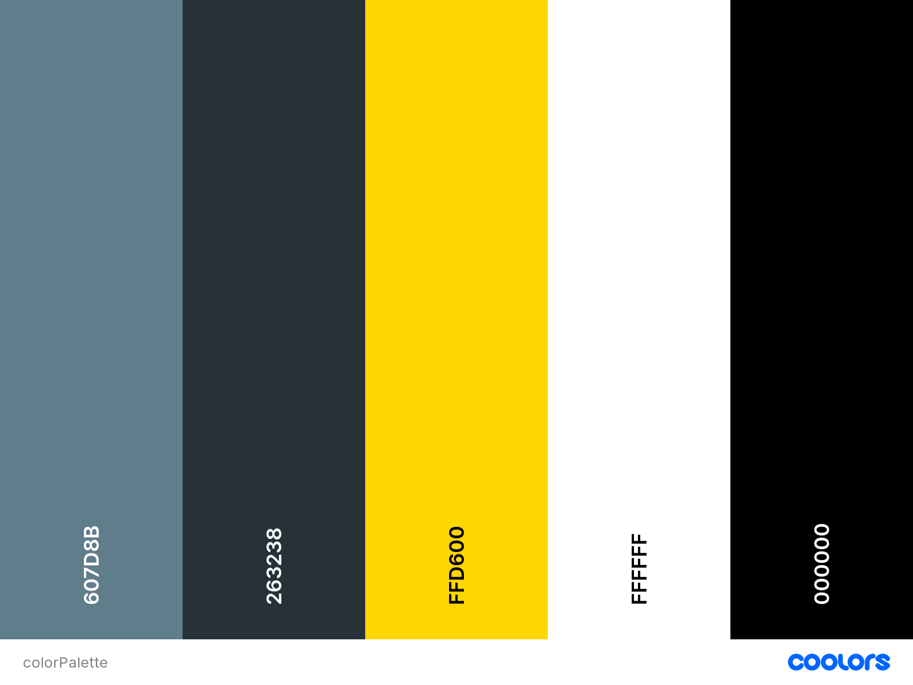
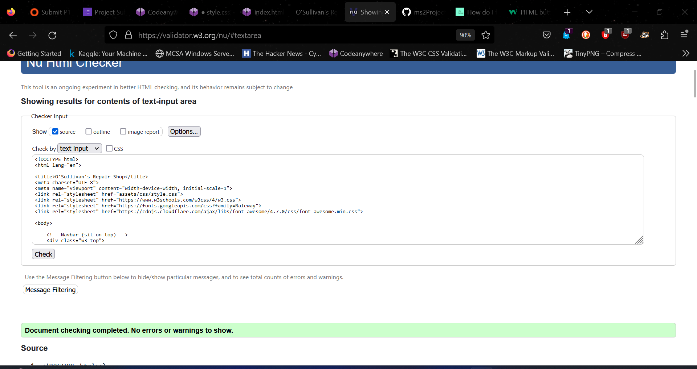
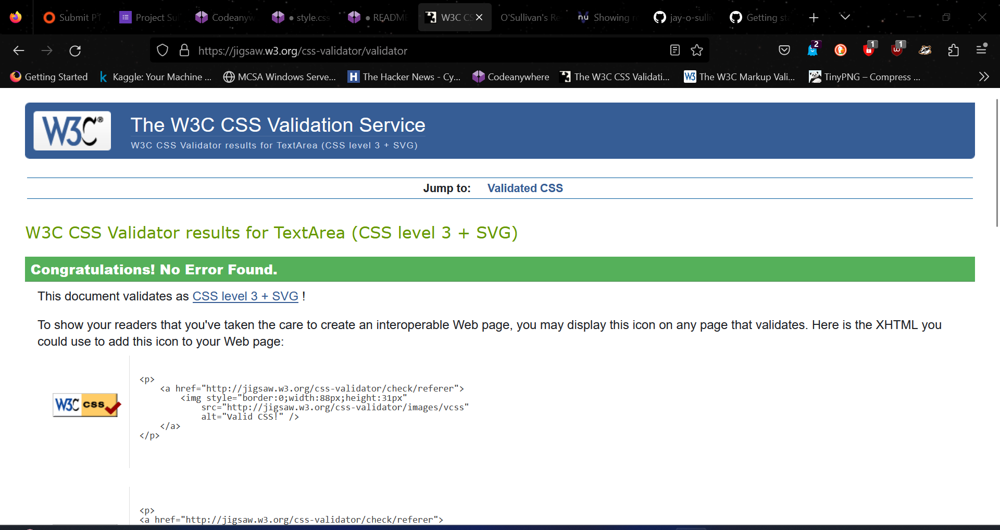
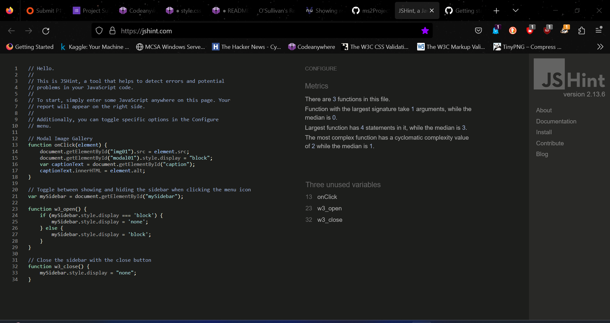
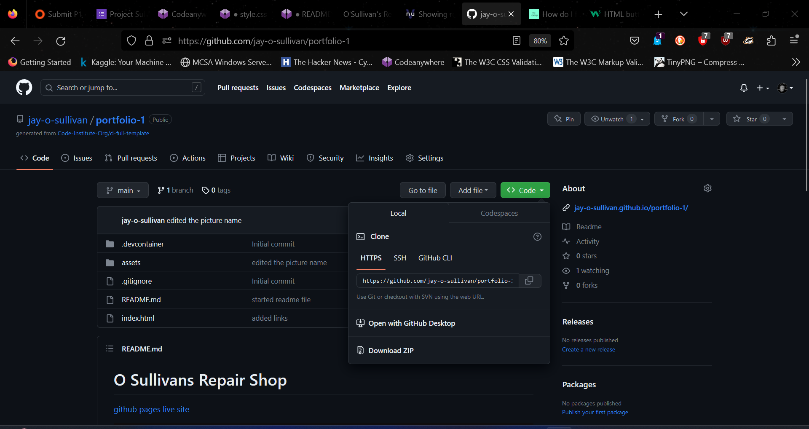

# O Sullivans Repair Shop

This website serves as an online presence for O'Sullivan's Repair Shop. Our shop offers a range of services including PC repair, hardware and software upgrades, and website development.
This website is designed to showcase our services, provide information about our team, display our past projects, and allow users to get in touch with us.

## Index

- [O Sullivans Repair Shop](#o-sullivans-repair-shop)
  - [Index](#index)
    - [Wireframes](#wireframes)
    - [Features](#features)
    - [Future Enhancements](#future-enhancements)
  - [UX/UI Design](#uxui-design)
  - [Technologies Used](#technologies-used)
  - [Testing](#testing)
    - [User Stories](#user-stories)
  - [Issues Fixed](#issues-fixed)
  - [Manual Testing](#manual-testing)
      - [Navigation Testing](#navigation-testing)
      - [Home Page Testing](#home-page-testing)
      - [Service Page Testing](#service-page-testing)
      - [Team Page Testing](#team-page-testing)
      - [Pricing Page Testing](#pricing-page-testing)
      - [Contact Form Testing](#contact-form-testing)
  - [Validators Used](#validators-used)
  - [Deployment](#deployment)
    - [Codeanywhere](#codeanywhere)
  - [Run code locally](#run-code-locally)
  - [Cloning](#cloning)
  - [Credits](#credits)
    - [Content](#content)
    - [Media](#media)
  - [Acknowledgements](#acknowledgements)

### Wireframes

The wireframes below is of the website.

- 

### Features

- **Service Descriptions:**  
  - Provides detailed information about the services offered by the repair shop.
  

- **Team Section:**
  - Introduces the team members and their roles.
  

- **Project Showcase:**
  - Displays past projects and work done by the repair shop.
  

- **Pricing Plans:**
  - Offers different pricing plans for services.
  

- **Contact Form:**
  - Allows users to get in touch with the repair shop.
  

### Future Enhancements

 *User Accounts:* Implement user accounts for customers to track their repairs.
 *Online Booking:* Allow users to schedule repair appointments online.
 *Live Chat Support:* Add a live chat feature for instant customer support.
 *Customer Reviews:* Include a section for customer reviews and testimonials.
 *Mobile App:* Develop a mobile app for easier access.

## UX/UI Design

The Colors I went with:

 I have focused on providing an engaging and intuitive user experience.

 Some of the key design considerations include:

  1. A clear and prominent site.
  2. Visual feedback.
  3. Visual indicators for contact form.

## Technologies Used

- **HTML5** - The markup language used for structuring the website.
- **CSS3** - The stylesheet language used for styling the website.
- **JavaScript** - The programming language used for interactive elements.
- **Font Awesome** - A library of icons used for visual enhancements.
- **Google Fonts** - Provides custom fonts for the website, improving the typography.

## Testing

### User Stories

- As a first time user, I want to find out what they have to offer, so that I can decide if it is the best place for me and/or my family to get pc repaired.

- As a first time user, I want to be able to easily navigate to about the company so i can find out more of what they do.

- As a first time user, I want to be able to get in contact with the right department, so that i can see if they have everthing for my pc repair and all other information.

- As a returning user, I want to easily access everything in the site.

- As a regular user, I want to get straight to the packages, so i can get my membership renewed.

## Issues Fixed

| Issues                                | Fixed  |
| ---                                   |  ---   |
| Removed syntax errors in readme file. | yes   |
| Responsive design with media queries  | yes |
| Contact form submission               | yes |

## Manual Testing

#### Navigation Testing

- Test all navigation links in the header, footer, and any other menus.
- Ensure that links to internal pages work correctly and take you to the intended destination.
- Test external links (e.g., social media links) to make sure they open in new tabs/windows.

#### Home Page Testing

- Verify that the home page loads without errors.
- Check the header and footer for consistency across all pages.
- Test the "Learn More" or similar buttons to make sure they take you to the relevant service or information.

#### Service Page Testing

- For each service offered (e.g., PC repair, hardware upgrades), visit the respective service page.
- Ensure that service descriptions and prices are accurate.

#### Team Page Testing

- Visit the team page and verify that team member profiles are displayed correctly.
- Check that the images and descriptions are aligned properly.

#### Pricing Page Testing

- Test the pricing plans or packages page.
- Verify that all pricing details and options are accurate.
- Check that any "Sign Up" button work as expected.

#### Contact Form Testing

- Go to the contact page.
- Test the contact form by filling it out with valid and invalid data.
- Ensure that form validation works correctly.

## Validators Used

- [W3C](https://validator.w3.org/nu/)
  

- [W3C](https://jigsaw.w3.org/css-validator/)
  

- [JSvalidator](https://jshint.com/)
  

## Deployment

The website was created using:

- [CodeAnywhere](https://codeanywhere.com/).
- [github pages](https://pages.github.com/)

### Codeanywhere

- In GitPod, ensure that all required items have been committed and pushed to GitHub.
- Sign in to GitHub.
- Choose the appropriate repository - jay-o-sullivan/portfolio1
- From the menu choose the settings tab.
- Then scroll down to github pages.
- Click the visit site to view the deployed website.

## Run code locally

There is different approaches should you choose to use GitPod to clone the project, or a different IDE.

  Use web browser -- google -- firefox etc.
  Login to your github account or sign up if you haven't.
  Install the gitpod extenstion for your browser.
  In github find the repository.
  Click on gitpod button.
  New workspace will open containing the project code.

## Cloning

1. Navigate to the github repository.
    - Choose the dropdown on the code button.

    

    - Open your IDE and terminal.
    - Set the working directory to location.
    - Type in "git clone" followed by the URL. Make sure to include a space after git clone for the url,   press enter.
Project created.

For more information:
    - [GitHub](https://docs.github.com/en)

## Credits

### Content

- [Code Institute Solutions - README Template](https://github.com/Code-Institute-Solutions/readme-template)
- [W3 Schools](https://www.w3schools.com/)
- [Coolors](https://coolors.co)

### Media

    Images used in this website were taking from:

- [am i responsive](http://ami.responsivedesign.is/)
- [pexels](https://www.pexels.com/)
- [pixabay](https://pixabay.com/)

## Acknowledgements

- [W3 Schools](https://www.w3schools.com/).
- [TingPNG](https://tinypng.com/).
- [github](https://github.com/jay-o-sullivan/video-games-quiz/edit/main/README.md)
- Student Support.
