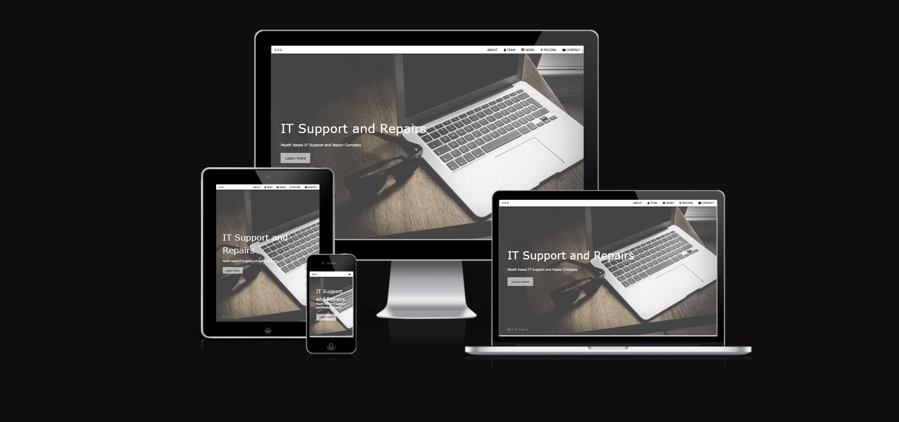

# O Sullivans Repair Shop

    This website serves as an online presence for O'Sullivan's Repair Shop. Our shop offers a range of services including PC repair, hardware and software upgrades, and website development. 
    This website is designed to showcase our services, provide information about our team, display our past projects, and allow users to get in touch with us.

## Index

1. [UX](#ux)
2. [Features](#features)
3. [Technologies Used](#technologies-used)
4. [Testing](#testing)
5. [Deployment](#deployment)
6. [Credits](#credits)

### Wireframes

    The wireframes below is of the website.

- [wireframes](assets/images/website-wireframe.pdf)

### Features

- **Service Descriptions:** Provides detailed information about the services offered by the repair shop.
- **Team Section:** Introduces the team members and their roles.
- **Project Showcase:** Displays past projects and work done by the repair shop.
- **Pricing Plans:** Offers different pricing plans for services.
- **Contact Form:** Allows users to get in touch with the repair shop.

### Future Enhancements

1. **User Accounts:** Implement user accounts for customers to track their repairs.
2. **Online Booking:** Allow users to schedule repair appointments online.
3. **Live Chat Support:** Add a live chat feature for instant customer support.
4. **Customer Reviews:** Include a section for customer reviews and testimonials.
5. **Mobile App:** Develop a mobile app for easier access.

## UX/UI Design

## Technologies Used

- **HTML5** - The markup language used for structuring the website.
- **CSS3** - The stylesheet language used for styling the website.
- **JavaScript** - The programming language used for interactive elements and quiz functionality.
- **Font Awesome** - A library of icons used for visual enhancements.
- **Google Fonts** - Provides custom fonts for the website, improving the typography.

## Testing

### User Stories

- As a first time user, I want to find out what they have to offer, so that I can decide if it is the best place for me and/or my family to get pc repaired.
- As a first time user, I want to be able to easily navigate to about the company so i can find out more of what they do.
- As a first time user, I want to be able to get in contact with the right department, so that i can see if they have everthing for my pc repair and all other information.
- As a returning user, I want to easily access everything in the site,
- As a regular user, I want to get straight to the packages, so i can get my membership renewed.

## Issues Fixed

## Manual Testing

## Validators Used

## Deployment

    The website was created using [CodeAnywhere](https://codeanywhere.com/).

### Codeanywhere

- In GitPod, ensure that all required items have been committed and pushed to GitHub.
- Sign in to GitHub.
- Choose the appropriate repository - jay-o-sullivan/portfolio1
- From the menu choose the settings tab.
- Then scroll down to github pages.
- Click the visit site to view the deployed website.

## Run code locally

There is different approaches should you choose to use GitPod to clone the project, or a different IDE.

- Use web browser -- google -- firefox etc.
- Login to your github account or sign up if you haven't.
- Install the gitpod extenstion for your browser.
- In github find the repository.
- Click on gitpod button.
- New workspace will open containing the project code.

## Credits

### Content

### Media

## Acknowledgements
